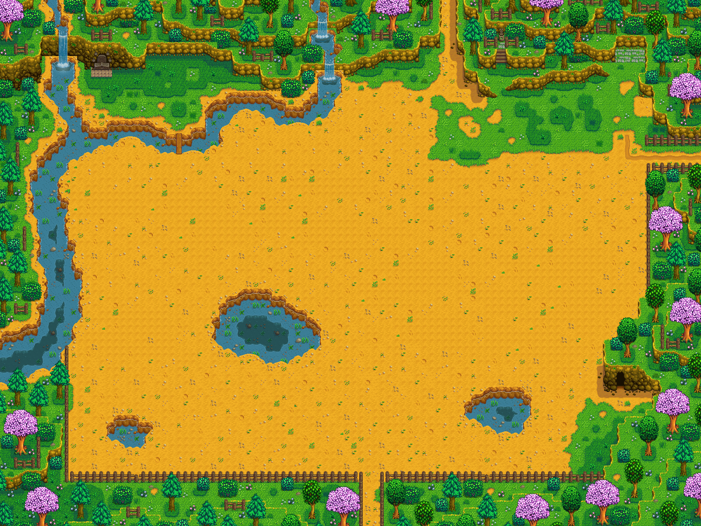
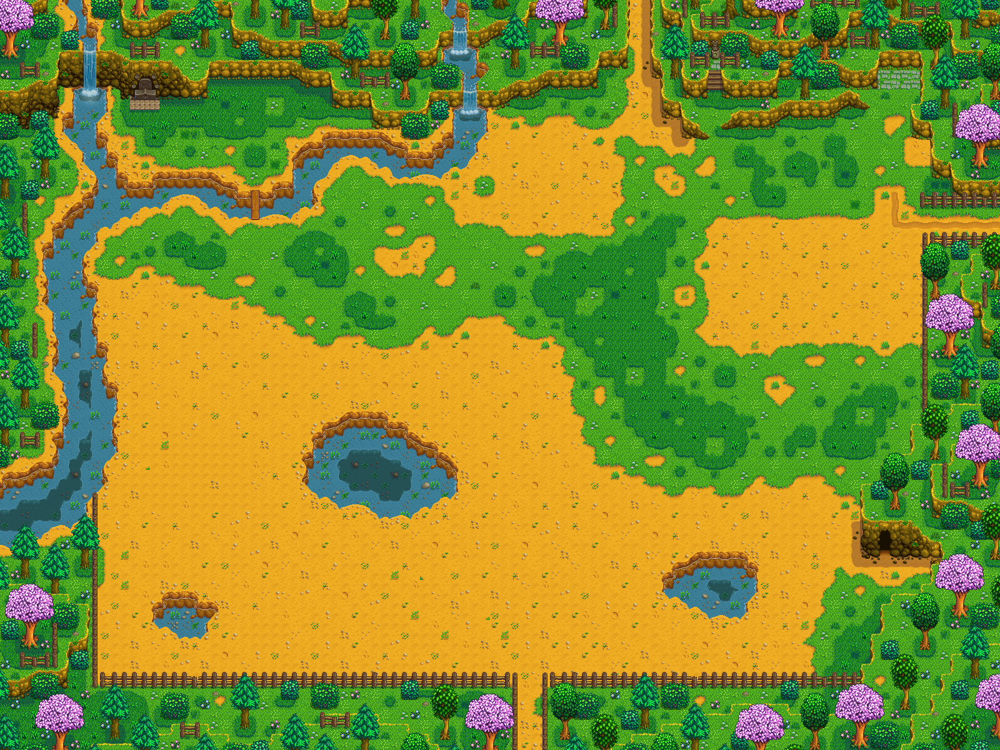
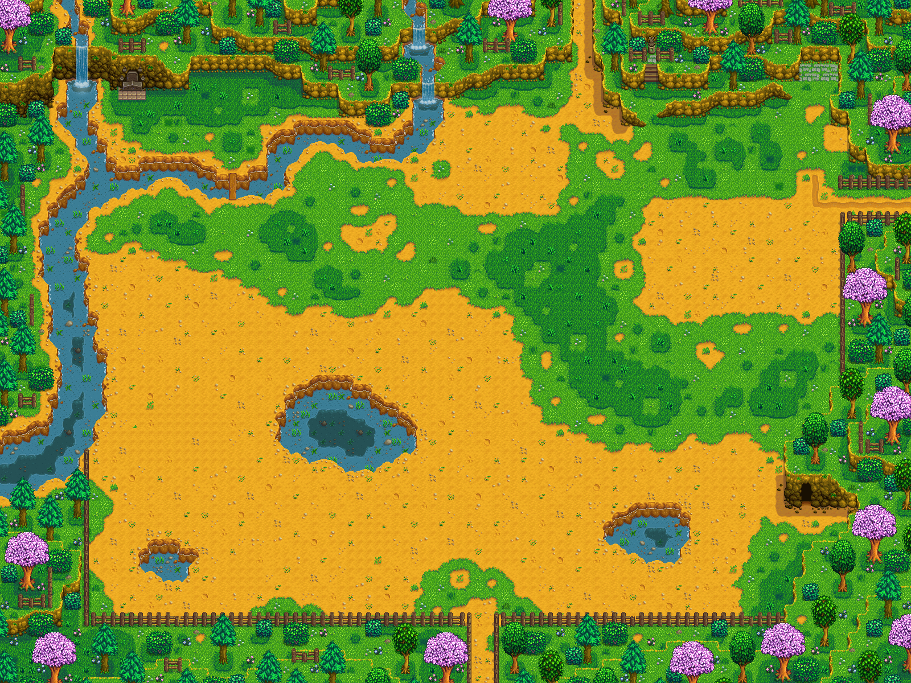
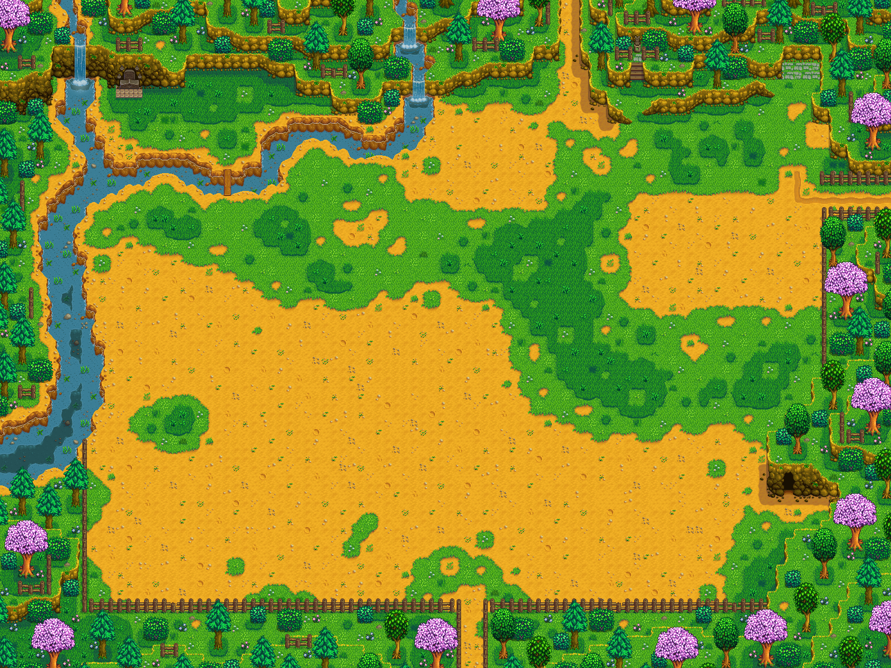
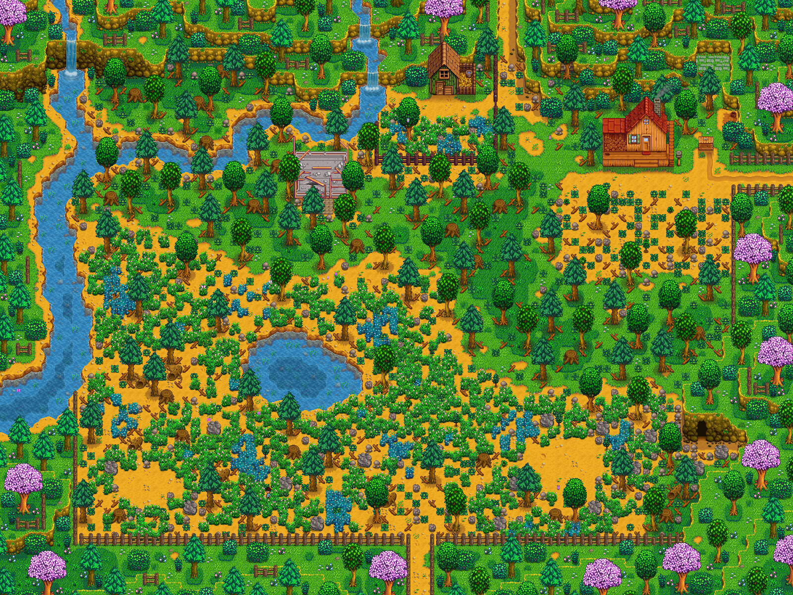

[Tweakable Meadowlands Farm](https://www.nexusmods.com/stardewvalley/mods/20742) adds options to configure grass, dirt, and ponds in Meadowlands Farm.

## Contents

* [Configuration](#configuration)
* [FAQ](#faq)
* [Notes](#notes)

## Configuration
> [!IMPORTANT]
> [Generic Mod Config Menu](https://www.nexusmods.com/stardewvalley/mods/5098) is highly recommended.

The mod config supports:

- Choosing between four different maps (one is the default)
- Setting the grass tiles to become tillable
- Removing pond(s)

Here look of some edited maps.

**FullDirtField**

**NeaterDirtField**

**NoRandomGrassPatches**

**Default map with pnds removed**

## FAQ

1. Can I use this mod in an ongoing save?  
Yes, you can! However, if you remove ponds, pond area will be an empty plot as default debris generation only occur during save file creation.
2. Can I remove this mod after using it in my save?
Yes, you can. The patch will not apply (ie. game will use default map). There's possibility of buildings or items on top of the pond. Especially if a pond was removed using the mod. Still, easily dealt with Noclip Mode.
3. Can I use this mod in multiplayer?
Yes, you can. Ideally with mod installed and with same setting on all players. Otherwise, you might see other farmer walking on water.

**Ponds removed in ongoing save**

## Notes
- User @lemonbby expressed annoyance on the random grass patches on this map in Stardew Valley discord, leading to idea for this mod